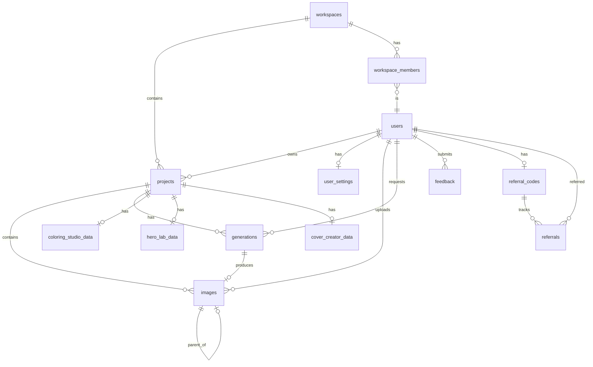

# Myjoe Creative Suite - Supabase Database Schema

> **Version**: 1.0  
> **Last Updated**: 2026-01-14  
> **Status**: Planning (Pre-Implementation)

---

## Table of Contents

1. [Overview](#overview)
2. [Storage Buckets](#storage-buckets)
3. [Core Tables](#core-tables)
4. [Multi-Tool Projects](#multi-tool-projects)
5. [Settings & Preferences](#settings--preferences)
6. [Workspaces & Teams](#workspaces--teams)
7. [Billing & Usage](#billing--usage)
8. [Admin & Feature Flags](#admin--feature-flags)
9. [GDPR & Privacy](#gdpr--privacy)
10. [Security & Anti-Abuse](#security--anti-abuse)
11. [Feedback & Announcements](#feedback--announcements)
12. [Referral Program](#referral-program)
13. [Amazon KDP Integration](#amazon-kdp-integration)
14. [Row Level Security Policies](#row-level-security-policies)

---

## Overview

### Architecture Principles

- **Supabase Auth** for authentication (magic link/passwordless)
- **Supabase Storage** for all file assets
- **Row Level Security (RLS)** on all tables
- **Soft deletes** where applicable (`is_archived`, `deleted_at`)
- **Audit trails** for sensitive operations

### URL Structure

| Tool | Prefix | Example URL |
|------|--------|-------------|
| Coloring Book Studio | `CB` | `/studio/CB847291` |
| Hero Lab | `HL` | `/studio/HL392847` |
| Cover Creator | `CC` | `/studio/CC102938` |
| Monochrome Maker | `MM` | `/studio/MM485736` |
| Story Book Creator | `SB` | `/studio/SB938472` |
| Paint by Numbers | `PN` | `/studio/PN847362` |

---

### Cloudflare R2 Storage Configuration

| Bucket | Access | Purpose |
|--------|--------|---------|
| `avatars` | Public | User profile pictures |
| `projects` | Private (signed URLs) | All project images, uploads, generated, edited |
| `exports` | Private (signed URLs) | PDF exports, data exports |
| `feedback` | Private (signed URLs) | Feedback screenshots |

### Storage Path Convention

```
projects/{user_id}/{project_id}/{image_id}.{ext}
avatars/{user_id}/avatar.{ext}
exports/{user_id}/{export_id}.{ext}
```

---

## Core Tables

### `users` (extends Supabase Auth)

| Column | Type | Nullable | Default | Description |
|--------|------|----------|---------|-------------|
| `id` | uuid | ❌ | PK, FK → auth.users | Supabase Auth user ID |
| `email` | text | ❌ | | From auth (denormalized) |
| `display_name` | text | ✅ | | User's preferred name |
| `avatar_url` | text | ✅ | | Cloudflare R2 path |
| `timezone` | text | ✅ | `'UTC'` | User's timezone |
| `locale` | text | ✅ | `'en-US'` | Preferred language |
| `is_whitelisted` | boolean | ❌ | `false` | Alpha access flag |
| `whitelist_granted_at` | timestamptz | ✅ | | When whitelist was granted |
| `is_admin` | boolean | ❌ | `false` | Admin panel access |
| `plan` | text | ❌ | `'free'` | `free`, `pro`, `team` |
| `plan_started_at` | timestamptz | ✅ | | When current plan began |
| `plan_expires_at` | timestamptz | ✅ | | For annual billing |
| `stripe_customer_id` | text | ✅ | | Stripe customer reference |
| `billing_email` | text | ✅ | | Separate billing email |
| `deleted_at` | timestamptz | ✅ | | Soft delete timestamp |
| `deletion_scheduled_for` | timestamptz | ✅ | | 30-day grace period |
| `created_at` | timestamptz | ❌ | `now()` | |
| `updated_at` | timestamptz | ❌ | `now()` | |

**Indexes:**
- `idx_users_email` on `email`
- `idx_users_stripe_customer` on `stripe_customer_id`

---

### `projects`

Shared table for all tools (Coloring Book Studio, Hero Lab, etc.)

| Column | Type | Nullable | Default | Description |
|--------|------|----------|---------|-------------|
| `id` | uuid | ❌ | `gen_random_uuid()` | Primary key |
| `public_id` | text | ❌ | | Unique, e.g., `CB847291`, `HL392847` |
| `tool_type` | text | ❌ | | Enum: `coloring_studio`, `hero_lab`, `cover_creator`, `monochrome_maker`, `storybook_creator`, `paint_by_numbers` |
| `user_id` | uuid | ✅ | FK → users | Owner (null if workspace-owned) |
| `workspace_id` | uuid | ✅ | FK → workspaces | Team owner (null if user-owned) |
| `title` | text | ❌ | `'Untitled'` | Project name |
| `description` | text | ✅ | | Optional notes |
| `cover_image_url` | text | ✅ | | Supabase Storage path |
| `visibility` | text | ❌ | `'private'` | `private`, `unlisted`, `public` |
| `share_token` | text | ✅ | | For unlisted sharing (future) |
| `share_token_created_at` | timestamptz | ✅ | | |
| `share_permission` | text | ✅ | | `view`, `edit`, `comment` |
| `is_archived` | boolean | ❌ | `false` | Soft delete |
| `created_at` | timestamptz | ❌ | `now()` | |
| `updated_at` | timestamptz | ❌ | `now()` | |

**Constraints:**
- `CHECK ((user_id IS NOT NULL) != (workspace_id IS NOT NULL))` — owned by user XOR workspace

**Indexes:**
- `idx_projects_public_id` UNIQUE on `public_id`
- `idx_projects_user_id` on `user_id`
- `idx_projects_workspace_id` on `workspace_id`

---

### `images`

Shared image storage for all tools.

| Column | Type | Nullable | Default | Description |
|--------|------|----------|---------|-------------|
| `id` | uuid | ❌ | `gen_random_uuid()` | Primary key |
| `project_id` | uuid | ❌ | FK → projects | Parent project |
| `user_id` | uuid | ❌ | FK → users | Owner (denormalized for RLS) |
| `type` | text | ❌ | | `upload`, `generated`, `edited` |
| `storage_path` | text | ❌ | | Cloudflare R2 path |
| `filename` | text | ✅ | | Original filename |
| `mime_type` | text | ✅ | | e.g., `image/png` |
| `width` | integer | ✅ | | Pixels |
| `height` | integer | ✅ | | Pixels |
| `file_size_bytes` | bigint | ✅ | | For storage quotas |
| `generation_prompt` | text | ✅ | | Prompt used (if generated) |
| `parent_image_id` | uuid | ✅ | FK → images | For version tree (edits) |
| `metadata` | jsonb | ✅ | `'{}'` | Tool-specific metadata |
| `created_at` | timestamptz | ❌ | `now()` | |

**Indexes:**
- `idx_images_project_id` on `project_id`
- `idx_images_user_id` on `user_id`
- `idx_images_parent` on `parent_image_id`

---

### `generations`

AI generation history across all tools.

| Column | Type | Nullable | Default | Description |
|--------|------|----------|---------|-------------|
| `id` | uuid | ❌ | `gen_random_uuid()` | Primary key |
| `project_id` | uuid | ❌ | FK → projects | |
| `user_id` | uuid | ❌ | FK → users | Denormalized for queries |
| `tool_type` | text | ❌ | | Denormalized from project |
| `prompt` | text | ❌ | | User's prompt |
| `model_version` | text | ❌ | | e.g., `gemini-2.0-flash-preview-image-generation` |
| `settings` | jsonb | ❌ | `'{}'` | Tool-specific: style, temperature, audience, etc. |
| `status` | text | ❌ | `'pending'` | `pending`, `processing`, `success`, `failed` |
| `error_message` | text | ✅ | | If failed |
| `result_image_id` | uuid | ✅ | FK → images | Output image |
| `duration_ms` | integer | ✅ | | Processing time |
| `created_at` | timestamptz | ❌ | `now()` | |
| `completed_at` | timestamptz | ✅ | | |

**Indexes:**
- `idx_generations_user_id` on `user_id`
- `idx_generations_project_id` on `project_id`
- `idx_generations_created_at` on `created_at`

---

## Multi-Tool Projects

### Tool-Specific Data Tables

Each tool has its own data table with a 1:1 relationship to `projects`.

#### `coloring_studio_data`

| Column | Type | Nullable | Default | Description |
|--------|------|----------|---------|-------------|
| `project_id` | uuid | ❌ | PK, FK → projects | |
| `style` | text | ✅ | | e.g., `whimsical`, `bold`, `minimalist` |
| `audience` | text | ✅ | | e.g., `toddlers`, `kids`, `adults` |
| `complexity` | text | ✅ | | e.g., `simple`, `medium`, `detailed` |
| `line_weight` | text | ✅ | | Thick, medium, fine |
| `page_count` | integer | ✅ | `1` | Number of pages |

#### `hero_lab_data`

| Column | Type | Nullable | Default | Description |
|--------|------|----------|---------|-------------|
| `project_id` | uuid | ❌ | PK, FK → projects | |
| `character_name` | text | ✅ | | |
| `pose` | text | ✅ | | Standing, action, portrait |
| `art_style` | text | ✅ | | Anime, comic, realistic |
| `background` | text | ✅ | | |

#### `cover_creator_data`

| Column | Type | Nullable | Default | Description |
|--------|------|----------|---------|-------------|
| `project_id` | uuid | ❌ | PK, FK → projects | |
| `book_title` | text | ✅ | | |
| `author_name` | text | ✅ | | |
| `genre` | text | ✅ | | Fiction, non-fiction, children's |
| `dimensions` | text | ✅ | | 6x9, 8.5x11, etc. |
| `spine_text` | text | ✅ | | |

#### `monochrome_maker_data`

| Column | Type | Nullable | Default | Description |
|--------|------|----------|---------|-------------|
| `project_id` | uuid | ❌ | PK, FK → projects | |
| `source_image_id` | uuid | ✅ | FK → images | Original image |
| `contrast_level` | text | ✅ | | Low, medium, high |
| `style` | text | ✅ | | Sketch, halftone, stipple |

#### `storybook_creator_data`

| Column | Type | Nullable | Default | Description |
|--------|------|----------|---------|-------------|
| `project_id` | uuid | ❌ | PK, FK → projects | |
| `story_theme` | text | ✅ | | Adventure, educational, fantasy |
| `reading_level` | text | ✅ | | Toddler, early reader, chapter book |
| `page_count` | integer | ✅ | | |
| `characters` | jsonb | ✅ | `'[]'` | Array of character definitions |

#### `paint_by_numbers_data`

| Column | Type | Nullable | Default | Description |
|--------|------|----------|---------|-------------|
| `project_id` | uuid | ❌ | PK, FK → projects | |
| `source_image_id` | uuid | ✅ | FK → images | |
| `num_colors` | integer | ✅ | `12` | Number of colors |
| `difficulty` | text | ✅ | | Easy, medium, hard |
| `color_palette` | jsonb | ✅ | | Generated color mapping |

---

## Settings & Preferences

### `user_settings`

| Column | Type | Nullable | Default | Description |
|--------|------|----------|---------|-------------|
| `user_id` | uuid | ❌ | PK, FK → users | |
| **Studio Preferences** |||||
| `enable_style_previews` | boolean | ❌ | `false` | |
| `enable_smart_defaults` | boolean | ❌ | `false` | |
| `enable_keyboard_shortcuts` | boolean | ❌ | `false` | |
| `enable_prompt_quality` | boolean | ❌ | `false` | |
| `enable_summary_card` | boolean | ❌ | `false` | |
| `enable_celebrations` | boolean | ❌ | `false` | |
| `enable_recent_prompts` | boolean | ❌ | `false` | |
| **UI Preferences** |||||
| `theme` | text | ❌ | `'dark'` | `dark`, `light`, `system` |
| `reduced_motion` | boolean | ❌ | `false` | |
| `default_tool` | text | ✅ | | Which tool to open by default |
| **Notifications** |||||
| `email_marketing` | boolean | ❌ | `false` | |
| `email_product_updates` | boolean | ❌ | `true` | |
| `email_generation_complete` | boolean | ❌ | `true` | |
| `email_login_alerts` | boolean | ❌ | `true` | |
| `updated_at` | timestamptz | ❌ | `now()` | |

---

## Workspaces & Teams

> [!NOTE]
> Schema-ready for future implementation. Not active at launch.

### `workspaces`

| Column | Type | Nullable | Default | Description |
|--------|------|----------|---------|-------------|
| `id` | uuid | ❌ | `gen_random_uuid()` | Primary key |
| `name` | text | ❌ | | "Jamie's Studio", "Acme Corp" |
| `slug` | text | ❌ | | URL-friendly: `acme-corp` |
| `owner_id` | uuid | ❌ | FK → users | Creator/admin |
| `avatar_url` | text | ✅ | | Workspace logo |
| `plan` | text | ❌ | `'free'` | Billing at workspace level |
| `stripe_customer_id` | text | ✅ | | |
| `created_at` | timestamptz | ❌ | `now()` | |
| `updated_at` | timestamptz | ❌ | `now()` | |

**Indexes:**
- `idx_workspaces_slug` UNIQUE on `slug`

### `workspace_members`

| Column | Type | Nullable | Default | Description |
|--------|------|----------|---------|-------------|
| `workspace_id` | uuid | ❌ | FK → workspaces | |
| `user_id` | uuid | ❌ | FK → users | |
| `role` | text | ❌ | `'viewer'` | `owner`, `admin`, `editor`, `viewer` |
| `invited_at` | timestamptz | ❌ | `now()` | |
| `accepted_at` | timestamptz | ✅ | | Null = pending invite |

**Primary Key:** `(workspace_id, user_id)`

---

## Billing & Usage

### `usage_tracking`

| Column | Type | Nullable | Default | Description |
|--------|------|----------|---------|-------------|
| `id` | uuid | ❌ | `gen_random_uuid()` | |
| `user_id` | uuid | ❌ | FK → users | |
| `period_start` | date | ❌ | | First of month |
| `generations_count` | integer | ❌ | `0` | |
| `uploads_count` | integer | ❌ | `0` | |
| `exports_count` | integer | ❌ | `0` | |
| `storage_bytes` | bigint | ❌ | `0` | |
| `api_calls_count` | integer | ❌ | `0` | |

**Primary Key:** `(user_id, period_start)`

### Plan Limits Reference

| Plan | Price | Generations | Storage (R2) | Exports | Tools |
|------|-------|-------------|--------------|---------|-------|
| `free` | $0 | 15/month | 100 MB | 3/month | Coloring Studio only |
| `starter` | $9.99/mo | 100/month | 1 GB | 25/month | All 6 tools |
| `pro` | $29.99/mo | 500/month | 10 GB | Unlimited | All 6 tools + priority |
| `team` | $19.99/seat | 500/seat/mo | 50 GB shared | Unlimited | All 6 tools + API |

---

## Admin & Feature Flags

### `feature_flags`

| Column | Type | Nullable | Default | Description |
|--------|------|----------|---------|-------------|
| `id` | uuid | ❌ | `gen_random_uuid()` | |
| `key` | text | ❌ | | Unique flag name |
| `enabled` | boolean | ❌ | `false` | |
| `description` | text | ✅ | | What this controls |
| `updated_at` | timestamptz | ❌ | `now()` | |
| `updated_by` | uuid | ✅ | FK → users | Admin who changed it |

**Initial Flags:**

| Key | Default | Purpose |
|-----|---------|---------|
| `billing_enabled` | `false` | Show billing UI |
| `teams_enabled` | `false` | Show workspace features |
| `sharing_enabled` | `false` | Allow project sharing |
| `hero_lab_enabled` | `false` | Enable Hero Lab |
| `cover_creator_enabled` | `false` | Enable Cover Creator |
| `monochrome_maker_enabled` | `false` | Enable Monochrome Maker |
| `storybook_creator_enabled` | `false` | Enable Story Book Creator |
| `paint_by_numbers_enabled` | `false` | Enable Paint by Numbers |
| `kdp_export_enabled` | `false` | Enable Amazon KDP export |
| `referral_enabled` | `false` | Enable referral program |
| `maintenance_mode` | `false` | Show maintenance page |

### `admin_audit_log`

| Column | Type | Nullable | Default | Description |
|--------|------|----------|---------|-------------|
| `id` | uuid | ❌ | `gen_random_uuid()` | |
| `admin_id` | uuid | ❌ | FK → users | Who made change |
| `action` | text | ❌ | | `toggle_feature`, `update_user`, etc. |
| `target_type` | text | ❌ | | `feature_flag`, `user`, etc. |
| `target_id` | text | ❌ | | ID of affected record |
| `old_value` | jsonb | ✅ | | Before state |
| `new_value` | jsonb | ✅ | | After state |
| `created_at` | timestamptz | ❌ | `now()` | |

---

## GDPR & Privacy

### `cookie_consent`

| Column | Type | Nullable | Default | Description |
|--------|------|----------|---------|-------------|
| `id` | uuid | ❌ | `gen_random_uuid()` | |
| `user_id` | uuid | ✅ | FK → users | Null for anonymous |
| `ip_hash` | text | ✅ | | Hashed IP for anonymous |
| `consent_version` | text | ❌ | | Privacy policy version |
| `essential` | boolean | ❌ | `true` | Always true |
| `functional` | boolean | ❌ | `false` | |
| `analytics` | boolean | ❌ | `false` | |
| `marketing` | boolean | ❌ | `false` | |
| `consented_at` | timestamptz | ❌ | `now()` | |

### `legal_documents`

| Column | Type | Nullable | Default | Description |
|--------|------|----------|---------|-------------|
| `id` | uuid | ❌ | `gen_random_uuid()` | |
| `type` | text | ❌ | | `privacy_policy`, `terms_of_service`, `referral_terms` |
| `version` | text | ❌ | | e.g., `v1.0`, `v1.1` |
| `content` | text | ❌ | | Markdown content |
| `requires_reconsent` | boolean | ❌ | `false` | |
| `published_at` | timestamptz | ❌ | `now()` | |

### `user_consent_records`

| Column | Type | Nullable | Default | Description |
|--------|------|----------|---------|-------------|
| `user_id` | uuid | ❌ | FK → users | |
| `document_type` | text | ❌ | | |
| `document_version` | text | ❌ | | |
| `accepted_at` | timestamptz | ❌ | `now()` | |

**Primary Key:** `(user_id, document_type)`

### `data_requests`

| Column | Type | Nullable | Default | Description |
|--------|------|----------|---------|-------------|
| `id` | uuid | ❌ | `gen_random_uuid()` | |
| `user_id` | uuid | ❌ | FK → users | |
| `request_type` | text | ❌ | | `export`, `delete` |
| `status` | text | ❌ | `'pending'` | `pending`, `processing`, `completed`, `failed` |
| `requested_at` | timestamptz | ❌ | `now()` | |
| `completed_at` | timestamptz | ✅ | | |
| `download_url` | text | ✅ | | Signed URL for export |
| `expires_at` | timestamptz | ✅ | | URL expiry |

---

## Security & Anti-Abuse

### `rate_limits`

| Column | Type | Nullable | Default | Description |
|--------|------|----------|---------|-------------|
| `user_id` | uuid | ❌ | FK → users | |
| `action_type` | text | ❌ | | `generation`, `upload`, `export`, `api_call` |
| `count` | integer | ❌ | `0` | Current count |
| `window_start` | timestamptz | ❌ | `now()` | |
| `window_hours` | integer | ❌ | `24` | Window duration |

**Primary Key:** `(user_id, action_type)`

### `blocked_emails`

| Column | Type | Nullable | Default | Description |
|--------|------|----------|---------|-------------|
| `domain` | text | ❌ | PK | Disposable email domain |
| `added_at` | timestamptz | ❌ | `now()` | |
| `source` | text | ✅ | | Where blocklist came from |

### `blocked_content`

| Column | Type | Nullable | Default | Description |
|--------|------|----------|---------|-------------|
| `id` | uuid | ❌ | `gen_random_uuid()` | |
| `pattern` | text | ❌ | | Keyword or regex |
| `type` | text | ❌ | | `trademark`, `nsfw`, `violence`, `hate` |
| `action` | text | ❌ | `'block'` | `warn`, `block`, `flag_for_review` |
| `created_by` | uuid | ✅ | FK → users | Admin who added |
| `created_at` | timestamptz | ❌ | `now()` | |

### `security_events`

| Column | Type | Nullable | Default | Description |
|--------|------|----------|---------|-------------|
| `id` | uuid | ❌ | `gen_random_uuid()` | |
| `user_id` | uuid | ✅ | FK → users | Null for anonymous |
| `event_type` | text | ❌ | | `failed_login`, `rate_limit_hit`, `suspicious_prompt`, etc. |
| `ip_address` | text | ✅ | | |
| `user_agent` | text | ✅ | | |
| `metadata` | jsonb | ✅ | `'{}'` | Additional context |
| `reviewed` | boolean | ❌ | `false` | Has admin reviewed |
| `created_at` | timestamptz | ❌ | `now()` | |

### `user_sessions`

| Column | Type | Nullable | Default | Description |
|--------|------|----------|---------|-------------|
| `id` | uuid | ❌ | `gen_random_uuid()` | |
| `user_id` | uuid | ❌ | FK → users | |
| `session_id` | text | ❌ | | From Supabase Auth |
| `device_fingerprint` | text | ✅ | | Browser fingerprint |
| `user_agent` | text | ✅ | | |
| `ip_address` | text | ✅ | | |
| `location` | text | ✅ | | City/Country |
| `last_active_at` | timestamptz | ❌ | `now()` | |
| `created_at` | timestamptz | ❌ | `now()` | |
| `is_current` | boolean | ❌ | `false` | Current session marker |

---

## Feedback & Announcements

### `feedback`

| Column | Type | Nullable | Default | Description |
|--------|------|----------|---------|-------------|
| `id` | uuid | ❌ | `gen_random_uuid()` | |
| `user_id` | uuid | ❌ | FK → users | |
| `type` | text | ❌ | | `bug`, `problem`, `suggestion`, `question`, `praise` |
| `message` | text | ❌ | | User's feedback |
| `page_url` | text | ✅ | | Where they submitted |
| `screenshot_url` | text | ✅ | | Cloudflare R2 path |
| `user_agent` | text | ✅ | | Browser/device |
| `status` | text | ❌ | `'new'` | `new`, `reviewed`, `in_progress`, `resolved`, `wont_fix` |
| `admin_notes` | text | ✅ | | Internal notes |
| `created_at` | timestamptz | ❌ | `now()` | |
| `updated_at` | timestamptz | ❌ | `now()` | |

### `announcements`

| Column | Type | Nullable | Default | Description |
|--------|------|----------|---------|-------------|
| `id` | uuid | ❌ | `gen_random_uuid()` | |
| `title` | text | ❌ | | |
| `content` | text | ❌ | | Markdown body |
| `type` | text | ❌ | | `feature`, `update`, `maintenance`, `tip` |
| `target_audience` | text | ❌ | `'all'` | `all`, `free`, `pro`, `new_users` |
| `is_dismissible` | boolean | ❌ | `true` | |
| `published_at` | timestamptz | ❌ | `now()` | |
| `expires_at` | timestamptz | ✅ | | Auto-hide after date |
| `created_by` | uuid | ❌ | FK → users | Admin |

### `dismissed_announcements`

| Column | Type | Nullable | Default | Description |
|--------|------|----------|---------|-------------|
| `user_id` | uuid | ❌ | FK → users | |
| `announcement_id` | uuid | ❌ | FK → announcements | |
| `dismissed_at` | timestamptz | ❌ | `now()` | |

**Primary Key:** `(user_id, announcement_id)`

---

## Referral Program

### `referral_codes`

| Column | Type | Nullable | Default | Description |
|--------|------|----------|---------|-------------|
| `user_id` | uuid | ❌ | PK, FK → users | |
| `code` | text | ❌ | | Unique, e.g., `JAMIE2024` |
| `referrals_count` | integer | ❌ | `0` | Total signups |
| `conversions_count` | integer | ❌ | `0` | Signups who upgraded |
| `rewards_earned` | integer | ❌ | `0` | Credits or free months |
| `terms_version` | text | ❌ | | Accepted T&C version |
| `terms_accepted_at` | timestamptz | ❌ | | |
| `created_at` | timestamptz | ❌ | `now()` | |

**Indexes:**
- `idx_referral_codes_code` UNIQUE on `code`

### `referrals`

| Column | Type | Nullable | Default | Description |
|--------|------|----------|---------|-------------|
| `id` | uuid | ❌ | `gen_random_uuid()` | |
| `referrer_id` | uuid | ❌ | FK → users | Who referred |
| `referred_id` | uuid | ❌ | FK → users | Who signed up |
| `referred_at` | timestamptz | ❌ | `now()` | |
| `converted` | boolean | ❌ | `false` | Did they upgrade? |
| `converted_at` | timestamptz | ✅ | | |
| `reward_granted` | boolean | ❌ | `false` | Was reward given? |

**Indexes:**
- `idx_referrals_referrer` on `referrer_id`
- `idx_referrals_referred` UNIQUE on `referred_id`

---

## Amazon KDP Integration

> [!NOTE]
> Schema-ready for future implementation.

### `kdp_exports`

| Column | Type | Nullable | Default | Description |
|--------|------|----------|---------|-------------|
| `id` | uuid | ❌ | `gen_random_uuid()` | |
| `project_id` | uuid | ❌ | FK → projects | |
| `user_id` | uuid | ❌ | FK → users | |
| `book_title` | text | ❌ | | |
| `author_name` | text | ❌ | | |
| `isbn` | text | ✅ | | If user has one |
| `dimensions` | text | ❌ | | 6x9, 8.5x11, etc. |
| `interior_type` | text | ❌ | | `black_white`, `color` |
| `cover_pdf_url` | text | ✅ | | Generated cover PDF |
| `interior_pdf_url` | text | ✅ | | Generated interior PDF |
| `status` | text | ❌ | `'pending'` | `pending`, `processing`, `ready`, `failed` |
| `created_at` | timestamptz | ❌ | `now()` | |
| `completed_at` | timestamptz | ✅ | | |

---

## Row Level Security Policies

### Core Policies

```sql
-- Users can only read/update their own profile
CREATE POLICY "Users manage own profile" ON users
  FOR ALL USING (auth.uid() = id);

-- Users can only access their own projects
CREATE POLICY "Users manage own projects" ON projects
  FOR ALL USING (
    user_id = auth.uid() 
    OR workspace_id IN (
      SELECT workspace_id FROM workspace_members 
      WHERE user_id = auth.uid()
    )
  );

-- Users can only access their own images
CREATE POLICY "Users manage own images" ON images
  FOR ALL USING (user_id = auth.uid());

-- Users can only see their own generations
CREATE POLICY "Users view own generations" ON generations
  FOR ALL USING (user_id = auth.uid());

-- Users can only access their own settings
CREATE POLICY "Users manage own settings" ON user_settings
  FOR ALL USING (user_id = auth.uid());

-- Admins can access feature flags
CREATE POLICY "Admins manage feature flags" ON feature_flags
  FOR ALL USING (
    EXISTS (SELECT 1 FROM users WHERE id = auth.uid() AND is_admin = true)
  );

-- Public can view published announcements
CREATE POLICY "Public view announcements" ON announcements
  FOR SELECT USING (published_at <= now() AND (expires_at IS NULL OR expires_at > now()));
```

---

## Entity Relationship Diagram



---

## Migration Notes

### Phase 1 (Launch)
- Create all core tables
- Enable RLS on all tables
- Seed feature flags (all disabled except `coloring_studio`)
- Insert initial blocked email domains

### Phase 2 (Post-Launch)
- Enable additional tools via feature flags
- Activate billing when Stripe integration ready
- Enable teams when workspace UI complete

---

*Document generated for Myjoe Creative Suite backend planning.*
