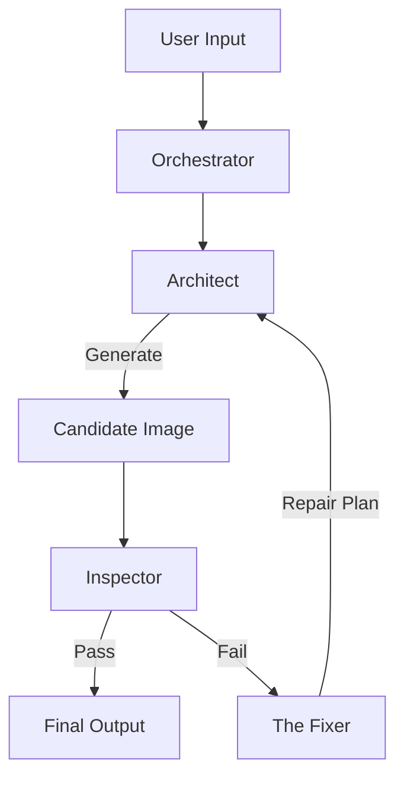

# Agent Protocol Manifest /init/agents.md

> [!IMPORTANT]
> This system uses a **Multi-Agentic Architecture** to generate professional coloring book pages.
> Each "Agent" is a specialized service with distinct responsibilities, models, and failure protocols.

---

## 1. The Orchestrator (v2.0)
**Role:** Pipeline Controller & State Manager
**File:** `src/server/ai/Orchestrator.ts`

The Orchestrator is the central nervous system that coordinates the generation lifecycle. It does not generate content itself but manages the hand-offs between agents.

### Responsibilities:
- **Pipeline Management:** Executes the `Enhance -> Generate -> QA -> Repair -> Retry` loop.
- **State Tracking:** Maintains the full `AttemptHistory` and tracks parameter drift (e.g., if complexity is auto-downgraded).
- **Progress Broadcasting:** Emits granular phase updates (`enhancing`, `generating`, `repairing`) to the UI.
- **Fallback Logic:** Decides when to abandon a failed approach and return a "best effort" result vs. a hard failure.

---

## 2. The Architect (Gemini Client v3.0)
**Role:** Prompt Engineer & Image Generator
**File:** `src/server/ai/gemini-client.ts`
**Models:** `gemini-3-pro-image-preview` (Generation), `gemini-2.0-flash-exp` (Planning)

The Architect is responsible for translating user intent into strict technical specifications. It enforces the "Positive Constraints" logic required by Google's Gemini 3 models.

### Core Capabilities:
- **Style Enforcer:** Maps human-readable styles (e.g., "Whimsical") to rigorous visual definitions (e.g., "Flowing curved lines, 0.5-1.5mm variable weight").
- **Complexity Manager:** Calibrates detail density (`regionRange`) to match the target audience (Toddlers vs. Adults).
- **Safety Layer:** Embeds critical negative constraints (No grayscale, No shading) directly into the prompt structure.
- **Prompt Planner:** Uses a lightweight text model to "enhance" vague user prompts into detailed scene descriptions before generation.

---

## 3. The Inspector (QA Service v2.1)
**Role:** Quality Assurance Analyst
**File:** `src/server/ai/qaService.ts`
**Model:** `gemini-2.0-flash-exp` (Vision Analysis)

The Inspector acts as the adversary to the Architect. It blindly analyzes the output image without "knowing" the prompt, ensuring the result stands on its own merits.

### Detection Matrix:
- **Critical Failures:**
  - `GREY_TONES_DETECTED`: Non-binary pixel values (fatal for printing).
  - `STIPPLING/HATCHING`: Textural shading that ruins coloring experience.
  - `UNCLOSED_REGIONS`: Gaps in lines that would cause paint leaks.
- **Composition Checks:**
  - `HORROR_VACUI`: Detects if the image is too dense (no rest areas).
  - `MOCKUP_FORMAT`: Detects if the AI generated a "photo of a drawing" instead of the drawing itself.
- **Audience Safety:** Validates content appropriateness (e.g., "No scary teeth for toddlers").

---

## 4. The Fixer (Repairs Service v2.1)
**Role:** Auto-Remediation Specialist
**File:** `src/server/ai/repairs.ts`

The Fixer intervenes when The Inspector flags issues. Instead of blindly retrying, it generates a **Targeted Repair Plan**.

### Repair Strategies:
- **Prompt Overrides:** Injects specific upper-case commands to counter defects (e.g., `[CRITICAL] NO TEXTURE MARKS. USE OUTLINED SHAPES ONLY.`).
- **Negative Boosting:** Loads the negative prompt with specific terms related to the detected failure (e.g., `shading, shadows, gradient`).
- **Parameter Escalation:** Can forcibly alter generation parameters (e.g., lowering `temperature` for Geometric accuracy, or downgrading `complexity` if regions are too small).

---

## System Flowchart

> [!NOTE]
> This architecture favors **Precision over Speed**. A single successful page typically requires 1-2 internal repair loops invisible to the user.
